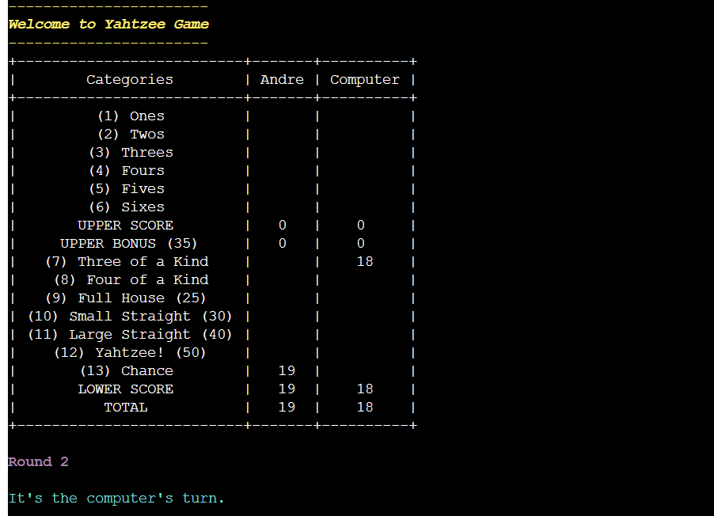

# Milestone Project 3 - Dice Game Yahtzee

## Description

Yahtzee is a popular dice game that will be played against to the computer. The objective of the game is to score points by rolling five dice to achieve specific combinations. Each turn, the player can roll the dice up to three times in an attempt to make a desired combination.

The game consists of 13 rounds, and each round, the player can choose which category to score in based on their dice roll. The categories include ones, twos, threes, fours, fives, sixes, three of a kind, four of a kind, full house, small straight, large straight, Yahtzee (five of a kind), and chance.

In the upper section of the score table, players score the sum of the numbers on the dice that match the category they choose. For example, if a player chooses the "fours" category and rolls 3 dice showing the number 4, they would score 12 points (4+4+4=12).

In the lower section, players score specific combinations. For example, if a player chooses the "full house" category and rolls three of one number and two of another, they score 25 points.

If a player rolls a Yahtzee, they can score 50 points in the Yahtzee category, but can also use it as a wild card for any other category. After all 13 rounds are completed, the player or the computer with the highest total score wins.

[View the live project here.](https://dice-game-yahtzee.herokuapp.com/)

---

## Table of Contents

1. [How To play](#how-to-play)
2. [User Experience (UX)](#user-experience)
    * [Goals](#goals)
3. [Logic Flowchart](#logic-flowchart)

4. [Features](#features)
    * [Existing Features](#existing-features)
    * [Future Features](#future-features)

5. [Data Model](#data-model)

5. [Testing](#testing)
    * [Solved Bugs](#solved-bugs)
    * [Validator testing](#validator-testing)
    * [Unfixed bugs](#unfixed-bugs)
5. [Deployment](#deployment)
6. [Credits](#credits)
    * [Code](#code)
    * [Acknowledgements](#acknowledgements)

---

## How to Play

More information aboout the Yahtzee dice game can be found in [wikipedia](https://en.wikipedia.org/wiki/Yahtzee)

In this version, the player has the possibility to view the game rules before the game starts.

It is required for the player to enter a name before the game begins.

Then the game will start with 13 rounds where, in each round, first the computer data, the category chosen by the computer, and the associated score will be displayed.

Second, 5 dice will be randomly allocated and displayed to the player, where the player can choose which dice to keep.

The skipped dice will be randomly allocated and displayed to the player, and the player can choose whether or not to keep all dice.

The player has 3 attempts to build the final dice.

Once the player reaches the final dice, a table will be displayed showing the possible score combinations, and the player will be required to choose one of the unscored categories.

The game will continue until all categories are scored.

At the end, a game over message will be displayed informing who the winner is (computer or player) by displaying the final score.

---

## User Experience (UX)

This project is designed for all users who like to have fun, play interactive games, test and exercise their logic, strategy and probability skills. The game was thought and designed for the user to play against the computer.

### Goals

#### *First Time users*

- For the first time, the goal is for the user to easily interact with the program in an intuitive way, to understand easily what information to enter when requested, and be able to easily understand the game rules.

#### *Returning users*

- As a returning, the aim is for the user to stay motivated and keep playing to complete the game with highest score as possible, improving the logic, strategy and probability skills.

---

## Logic Flowchart

This flowchart tracks the basic steps and checks the program must make to run based on each of the user's potential requirements and inputs.

The flowchart was built using [lucidchart website](https://www.lucidchart.com)

---

## Features

### Existing Features

1. **Title and Rules option**

- At the start of the program a welcome message will be displayed showing the game title.

- Then a user input "y or n" will be required (can be uppercase or lowercase). The user can enter "y" for yes if he decides to check the game rules before the game starts or "n" to not view the game rules and allow the program to proceed to the game interface.

- If the user enters invalid input, none of "y" or "n", an error will be displayed and new input will be required from the user.

2. **Rules Display**

- If the user enters "y" to check the game rules, the rules will be displayed.

- Then if user press enter, the rules will be clear from terminal and inicial question ("Would you like to see the game rules? Choose (y/n) then press Enter:") will be displayed.

3. **Name input**

- When user enter "n" in the first required input and second input will be displayed for user to enter name or any characters. It is required to the user to enter any text or characters.

- If user just simply press enter without entering any characters an error message will be displayed requesting to the user to enter some text.

4. **Game start**

- After user input name and press enter, game will start running by displaying round 1, computer game information, random dice, chosen category and associated score.

- Then 5 random dice will be allocated and displayed to the user. Here the user has the opportunity in 2 attempts to keep and skip dices in order to try to get the best and desired dice combination.

- 2 inputs will be sequentially display requesting for user to enter valid and desired information.

- If user inputs not valid data, 2 errors can appear. One for non-numeric characters and the other for numeric characters outside the range of numbers 1 to 5, referring to the position of each dice. 

- Once user reach to the final dice a table will be displayed showing the possible score from the final dice combination for unscored categories only.

- Then an input will be displayed for user to choose and enter one of the unscored categories, it could be one of the suggested categories in the possible scoring table or another unscored category with 0 score.

- If the dice combination gives only a 0 score for remaining unscored categories, a message will be displayed instead of the possible score table.

- If the user enters invalid information, one of the following errors may appear:
    - For non numeric values. 
    - For numeric values out of the range 1 to 13. 
    - For numeric values within range 1 to 13 but category is scored already.

- Once the user has chosen a valid category, all previous information will be erased from the terminal and a table will be displayed showing the scores of the categories already scored in each stage of the game and the sum of all the scores of the user and the computer.

5. **Game end**

- The game will run progressively until the entire score table is filled.

- Once the score table is completed a game over message will appear informing the game is over and who is the winner.

### Potential Future Features

- Computer to be more capable of making wiser decisions in each category to choose from in order to increase the difficulty of the game.

---

## Data Model

The following table model was adopted to store the user and computer scores of each category as the game progressed and to give the user a clear view of the score achived by both players (user and computer).

Scores are kept in a dictionary and displayed through a table in the terminal using the print method.

---

## Technologies Used

In this project the following technologies have been used.

### Languages Used

- [Python](https://www.python.org/) used for logic structure of the game.

### Other Technologies, Frameworks & Libraries

#### Native Modules & Libaries

- [Random](https://docs.python.org/3/library/random.html)
    - Used to provide random dice

#### External Modules & Libraries

- [Prettytable](https://pypi.org/project/prettytable/)
    - Used to create score table

- [Tabulate](https://pypi.org/project/tabulate/)
    - Used to create possible score table

- [Git](https://git-scm.com/)
    - Used for version control by utilizing the Gitpod terminal to commit to Git and Push to GitHub.

- [GitHub:](https://github.com/)
    - Used to store the projects code after being pushed from Git.

- [Heroku](https://dashboard.heroku.com/)
    - Used to deploy project

- [lucidchart website](https://www.lucidchart.com)
    - Used to create logic flow chart

---

## Testing

- The program was manually tested by doing the following:
    - Passed the code through a PEP8 linter and confirmed there are no errors.
    - Given invalid and incorrect inputs.
    - Tested in local terminal and the code institute Heroku terminal.

Testing was performed on all incorrect player input...

Along the development of the project regular testing were carried out. And the pages were reloaded several times after each addition and modification.

1. This website is responsive to all screens sizes down to 280px wide and was tested by using the devtools device toolbar for different devices.

2. The navigation buttons were tested and all work well.

3. Modals were tested and all work well and are responsive to different screen sizes.

4. All game leves were tested and all work well, cards are flipping, keep revealed if it matches and hide if it doesn't, moves are increasing with each flipped card and time is counting down. Gameover Modal is popping when time is finished before all cards are revealed and win modal is popping when all card are revealed before time is finished. When the reset button is clicked, moves will reset to zero, revealed cards will be hidden, and time will reset to initial.

### Validator Testing

The Python files have been ran through a [PEP8 Python Validator](https://pep8ci.herokuapp.com/) 

All identified errors were rectified.

Currently there are no errors meeting all PEP8 requirements according to this validator:

5. The website code was both tested, manually and automatically (using the URL link) for HTML and CSS, through W3C Markup Validator and W3C CSS Validator Services, and  manually tested for JavaScript through JSHint which were used to validate the project and to ensure there were no syntax errors in the project.

### Bugs

- Along the project development bugs were identified and resolved by using the print method in local terminal.

### Unfixed Bugs

No unfixed bugs were found.

---

## Deployment

This project was deployed using the Heroku Cloud applictaion platform and was deployed using code Institute's mock terminal for Heroku. 

Before deploy the project to Heroku to following packges were included to the requiremnets.txt files provided code Institute tamplete to allow Heroku app install these packges:

Before deploying the project to Heroku, the following packages were included in the requirements.txt file provided with the Code Institute template to allow the Heroku app to install these packages:

- prettytable==3.7.0
- tabulate==0.9.0

- The deployment steps in Heroku app are as follows:
    1. Git add and git commit all changes made;

    2. Log into [Heroku](https://dashboard.heroku.com/) or create a new account and log in;

    3. top right-hand corner click "New" and choose the option Create new app, if you are a new user, the "Create new app" button will appear in the middle of the screen;

    4. Write app name - it has to be unique, it cannot be the same as this app;

    5. Choose Region - I am in Europe;

    6. Click "Create App" The page of your project opens;

    7.  Choose "settings" from the menu on the top of the page;

    8. Go to section "Config Vars" and click the button "Reveal Config Vars";

    9. In the field for "KEY" enter "PORT"-  capital letters and value"8000";

    10. Go to section "Build packs" and click "Add build pack":

        * in this new window - click Python and "Save changes" [`Heroku/Python`]
        * click "Add build pack" again
        * in this new window - click Node.js and "Save changes" [`Heroku/NodeJS`]
        * take care to have those apps in this order: [`Python`] first, [`Node.js`] second, drag and drop if needed

    11. Next go to "Deploy" in the menu bar on the top;

    12. Go to section "deployment method", choose "GitHub";
    
    13. Link the Heroku app to the repository by clicking search in the connect to GitHUb section and choose the relevant github repository;

    14. Click on Automatic deploys or manual deploy depending on preference. Automatic deploy was chosen for this project;

- The GitHub repository can be found [here](https://github.com/AndreFarinha86/dice-game-yahtzee)

- The live link can be found [here](https://dice-game-yahtzee.herokuapp.com/)

---

## Credits

### Code

All code was cretead by the developer, guided and inspired by the Yahtzee game app, [Love Sandwiches - Essentials Project](https://github.com/Code-Institute-Solutions/love-sandwiches-p5-sourcecode/tree/master/04-adding-stock-data/02-calculating-our-stock-averages) from code Institute, [stackoverflow](https://stackoverflow.com/) and online various pages and videos.

### Acknowledgements

- To my mentor, [Jack Wachira](https://github.com/iamjackwachira), for support me along the project, provide the required assistance and guide me in the right direction.
- The Slack community. All the help, support and information available from other students is really a great tool.
- The Heroku Python template was provided by Code Institute.
- The Yahtzee game app to provide game rules.

---